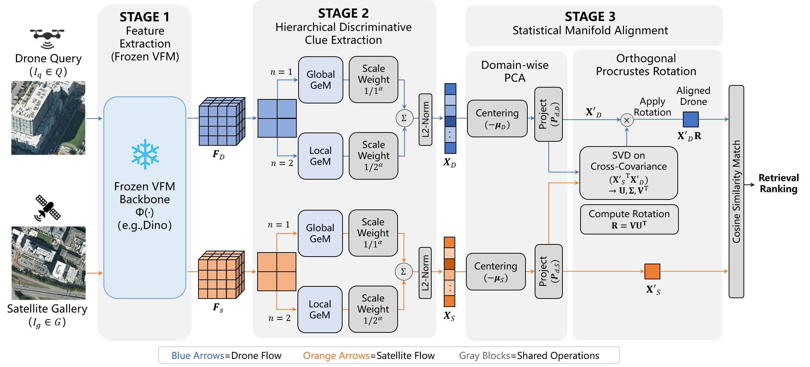
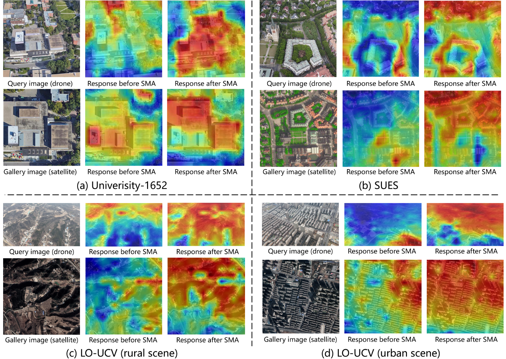

# VFM-Loc

PyTorch release for the paper **VFM-Loc: Zero-Shot Cross-View Geo-Localization via Aligning Discriminative Visual Hierarchies**.

- Training-free
- Zero-shot
- PyTorch implementation for VFM-Loc



## Installation

```bash
pip install -r requirements.txt
```

## Data Directory

Edit:

```yaml
configs/base/eval_base.yaml
```

and change:

```yaml
dataset:
  data_root: /path/to/your/University/
```

You can also override `dataset.data_root` in any file under `configs/eval/`.

Pretrained checkpoints should be placed under `pretrained_weights/`, for example:

```text
pretrained_weights/
└── dinov3/
    └── dinov3_vitb16_pretrain_lvd1689m-73cec8be.pth
```

## Evaluation

```bash
python eval.py --config configs/eval/u1652_dinov3_zero_shot.yaml
```

Other examples:

- `configs/eval/cvusa_dinov3_zero_shot.yaml`
- `configs/eval/cvact_dinov3_zero_shot.yaml`
- `configs/eval/vigor_same_dinov3_zero_shot.yaml`

## Visualization

### Regional Similarity



We visualize spatial similarity distributions of representative UAV-satellite pairs before and after manifold alignment. Patch-level DINOv3 features are kept in their spatial layout, then domain-wise PCA and Orthogonal Procrustes are applied. The resulting rotation is used to align UAV patch features, and cosine similarity between each aligned UAV patch and the global pooled satellite feature is converted into normalized heatmaps.

Before alignment, similarity responses are often diffuse and distracted by background clutter, reflecting the distribution gap between oblique UAV views and nadir satellite views. After alignment, the responses become much more concentrated on geometrically stable structures such as roof outlines and road intersections. This qualitative result supports the role of the statistical manifold alignment module in suppressing view-specific noise and enhancing discriminative cross-view landmarks.

## Notes

- This release is focused on the **training-free, zero-shot** VFM-Loc pipeline.
- `eval.py` is the recommended entry point.
- The release implementation no longer depends on `VFM_CVGL/core/dinov3`.
- The **LO-UCV** dataset will be released.
- Additional backbones such as **Radio** will be added.

## Coming Soon

- LO-UCV dataset release
- Radio backbone support
- More zero-shot evaluation configs

## Citation

```bibtex
@article{lu2026vfmloc,
  title   = {VFM-Loc: Zero-Shot Cross-View Geo-Localization via Aligning Discriminative Visual Hierarchies},
  author  = {Jun Lu and Zehao Sang and Haoqi Wei and Xiangyun Liu and Kun Zhu and Haitao Guo and Zhihui Gong and Lei Ding},
  journal = {arXiv preprint arXiv:2603.13855},
  year    = {2026}
}
```
